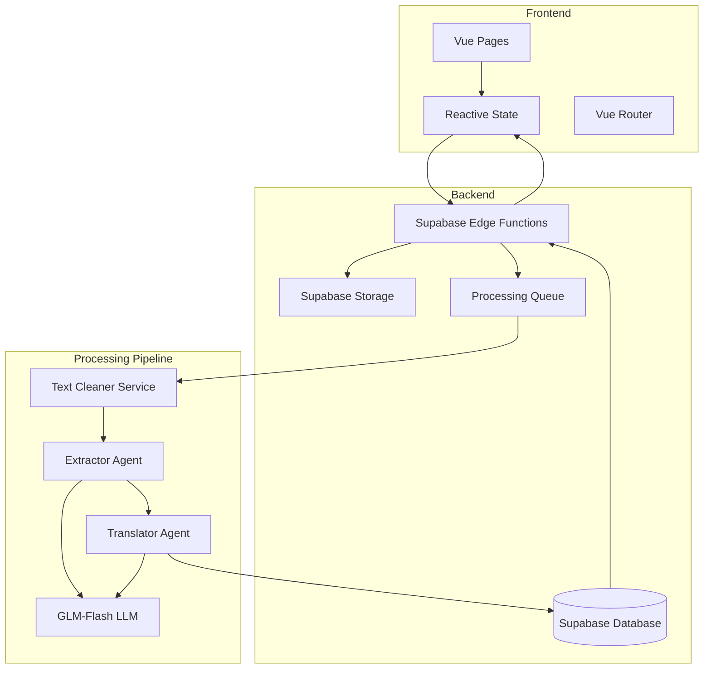
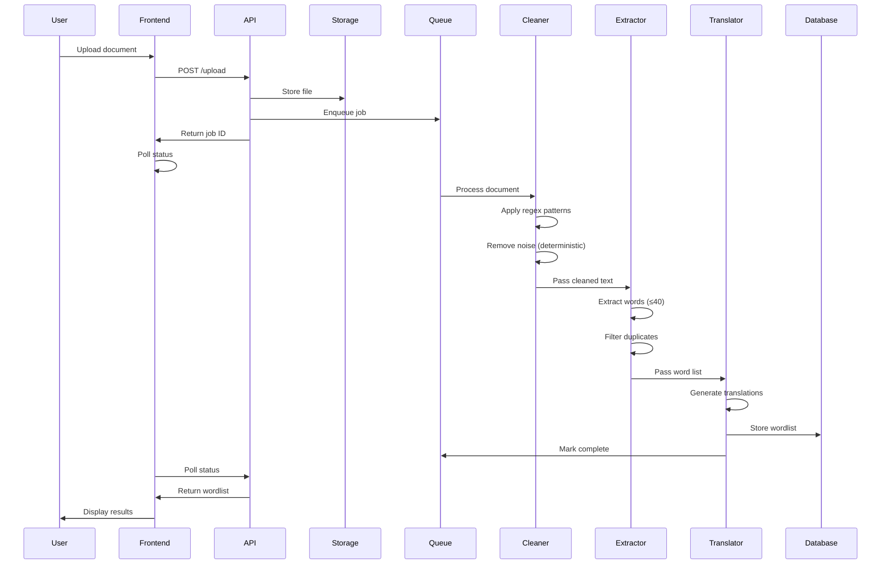

# Design Document: AI Wordlist Extraction

## Overview

This design implements a three-stage AI pipeline for extracting bilingual wordlists from uploaded documents. The system uses Supabase for backend services, GLM-Flash LLM for AI processing, and Vue 3 with Composition API for the frontend. The architecture follows a reactive state management pattern with clear separation between frontend UI, state management, and backend services.

The system processes documents through a hybrid pipeline combining traditional text processing with AI agents:
1. **Text Cleaner Service**: Uses regex and heuristics to remove noise (headers, footers, page numbers)
2. **Extractor Agent**: AI-powered identification of up to 40 key English words
3. **Translator Agent**: AI-powered generation of Mandarin translations

## Architecture

### Design Rationale: Traditional Text Cleaning vs LLM-Based Cleaning

The system uses **traditional regex and heuristic-based text cleaning** instead of an LLM-based Cleaner Agent for several key reasons:

**Cost Efficiency:**
- Traditional cleaning is free, while LLM calls incur API costs per document
- Saves ~30-40% of total LLM token budget for the actual AI tasks (extraction and translation)

**Performance:**
- Regex patterns execute in milliseconds vs seconds for LLM calls
- Helps meet the 30-second processing target for 30-page PDFs
- No network latency or API rate limiting concerns

**Predictability:**
- Deterministic output ensures consistent cleaning behavior
- Easier to debug and refine specific patterns
- No risk of LLM hallucinations or inconsistent decisions

**Simplicity:**
- Well-understood patterns for common noise (headers, footers, page numbers)
- Easier to maintain and extend with new patterns
- No prompt engineering required

**When LLM Cleaning Would Make Sense:**
- Complex academic papers with inconsistent formatting requiring semantic understanding
- Documents where context is critical for determining what constitutes "noise"
- Cases where the cost and latency trade-offs are acceptable

For a vocabulary extraction tool targeting learners with standard document formats, traditional cleaning is the optimal choice.

### High-Level Architecture



### Processing Flow



## Components and Interfaces

### Frontend Components

#### 1. State Management (`src/state/`)

**uploadState.ts** (Enhanced)
```typescript
interface UploadItem {
  id: string
  file: File
  status: 'queued' | 'uploading' | 'processing' | 'completed' | 'failed'
  progress: number // 0-100
  jobId?: string
  error?: string
  wordPairs?: WordPair[]
  processingStage?: 'cleaning' | 'extracting' | 'translating'
}

interface WordPair {
  en: string
  zh: string
}

interface UploadState {
  uploads: UploadItem[]
  globalConcurrentLimit: number
  lastUploadTime: number | null
  cooldownMs: number
}
```

**wordlistsState.ts** (Enhanced)
```typescript
interface WordlistRecord {
  id: string
  filename: string
  createdAt: Date
  words: WordPair[]
  documentType: string
  wordCount: number
}

interface WordlistsState {
  wordlists: WordlistRecord[]
  loading: boolean
  error: string | null
}
```

#### 2. Service Layer (`src/services/`)

**uploadService.ts**
```typescript
interface UploadResponse {
  jobId: string
  status: string
  queuePosition?: number
}

interface JobStatus {
  status: 'queued' | 'processing' | 'completed' | 'failed'
  progress: number
  stage?: 'cleaning' | 'extracting' | 'translating'
  result?: WordPair[]
  error?: string
}

async function uploadDocument(file: File): Promise<UploadResponse>
async function pollJobStatus(jobId: string): Promise<JobStatus>
async function cancelJob(jobId: string): Promise<void>
```

**wordlistService.ts**
```typescript
async function saveWordlist(filename: string, words: WordPair[]): Promise<string>
async function fetchWordlists(): Promise<WordlistRecord[]>
async function deleteWordlist(id: string): Promise<void>
async function exportWordlist(id: string, format: 'csv' | 'xlsx'): Promise<Blob>
```

#### 3. Composables (`src/composables/`)

**useUpload.ts**
```typescript
function useUpload() {
  const canUpload = computed(() => ...)
  const queuePosition = computed(() => ...)
  const cooldownRemaining = computed(() => ...)
  
  async function uploadFiles(files: File[]): Promise<void>
  function validateFile(file: File): { valid: boolean; error?: string }
  
  return { canUpload, queuePosition, cooldownRemaining, uploadFiles, validateFile }
}
```

**useWordlist.ts**
```typescript
function useWordlist() {
  async function loadWordlists(): Promise<void>
  async function saveCurrentWordlist(filename: string, words: WordPair[]): Promise<void>
  async function removeWordlist(id: string): Promise<void>
  async function downloadWordlist(id: string, format: 'csv' | 'xlsx'): Promise<void>
  
  return { loadWordlists, saveCurrentWordlist, removeWordlist, downloadWordlist }
}
```

### Backend Components

#### 1. Supabase Edge Functions

**upload-document** (`supabase/functions/upload-document/`)
- Validates file type and size
- Checks global concurrent upload limit
- Enforces user cooldown period
- Stores file in Supabase Storage
- Enqueues processing job
- Returns job ID and queue position

**process-document** (`supabase/functions/process-document/`)
- Triggered by queue
- Orchestrates three-stage AI pipeline
- Updates job status and progress
- Handles retries and error recovery
- Stores final wordlist in database

**job-status** (`supabase/functions/job-status/`)
- Returns current job status
- Provides progress updates
- Returns wordlist when complete

**wordlist-export** (`supabase/functions/wordlist-export/`)
- Generates CSV or XLSX files
- Handles proper encoding (UTF-8 with BOM)
- Returns downloadable blob

#### 2. Text Processing Services

**TextCleanerService** (`supabase/functions/_shared/cleaners/textCleaner.ts`)
```typescript
interface CleanerInput {
  rawText: string
  documentType: string
}

interface CleanerOutput {
  cleanedText: string
  cleanlinessScore: number // 0-1, internal metric
  removedPatterns: string[] // Types of patterns removed
  stats: {
    originalLength: number
    cleanedLength: number
    linesRemoved: number
  }
}

function cleanText(input: CleanerInput): CleanerOutput
```

**Cleaning Strategies:**
- **Headers/Footers**: Regex patterns for common formats (page X of Y, dates, chapter titles)
- **Page Numbers**: Detect standalone numbers or patterns like "[1]", "- 1 -"
- **Table of Contents**: Identify repeated dot patterns with page numbers
- **Indexes**: Detect alphabetically sorted lists with page references
- **Whitespace**: Normalize multiple newlines, trim excessive spaces
- **Special Characters**: Remove non-printable characters, fix encoding issues
- **Captions**: Remove "Figure X:", "Table X:", "Image X:" patterns
- **URLs and Emails**: Optional removal based on document type

#### 3. AI Agent Services

**ExtractorAgent** (`supabase/functions/_shared/agents/extractor.ts`)
```typescript
interface ExtractorInput {
  cleanedText: string
  maxWords: number // Always 40
}

interface ExtractorOutput {
  words: string[]
  confidence: number
  filteredCount: number // How many duplicates/stop words removed
}

async function extract(input: ExtractorInput): Promise<ExtractorOutput>
```

**TranslatorAgent** (`supabase/functions/_shared/agents/translator.ts`)
```typescript
interface TranslatorInput {
  words: string[]
  context?: string // Optional document context for polysemous words
}

interface TranslatorOutput {
  translations: WordPair[]
  confidence: number
  fallbackUsed: string[] // Words that used fallback translation
}

async function translate(input: TranslatorInput): Promise<TranslatorOutput>
```

#### 4. LLM Service

**llmService.ts** (`supabase/functions/_shared/llm/`)
```typescript
interface LLMRequest {
  prompt: string
  systemPrompt?: string
  maxTokens?: number
  temperature?: number
}

interface LLMResponse {
  content: string
  tokensUsed: number
  latency: number
  model: string
}

interface LLMMetrics {
  promptTokens: number
  completionTokens: number
  totalTokens: number
  latencyMs: number
  timestamp: Date
  agentType: 'extractor' | 'translator'
}

async function callLLM(request: LLMRequest): Promise<LLMResponse>
async function callWithRetry(request: LLMRequest, maxRetries: number): Promise<LLMResponse>
function logMetrics(metrics: LLMMetrics): void
```

#### 5. Document Parser

**documentParser.ts** (`supabase/functions/_shared/parsers/`)
```typescript
interface ParsedDocument {
  text: string
  pageCount?: number
  documentType: string
  metadata: Record<string, any>
}

async function parsePDF(buffer: ArrayBuffer): Promise<ParsedDocument>
async function parseTXT(buffer: ArrayBuffer): Promise<ParsedDocument>
async function parseDOCX(buffer: ArrayBuffer): Promise<ParsedDocument>
async function parseXLSX(buffer: ArrayBuffer): Promise<ParsedDocument>
```

#### 6. Queue Management

**queueService.ts** (`supabase/functions/_shared/queue/`)
```typescript
interface QueueJob {
  id: string
  userId: string
  fileId: string
  status: 'queued' | 'processing' | 'completed' | 'failed'
  priority: number
  createdAt: Date
  startedAt?: Date
  completedAt?: Date
  retryCount: number
  error?: string
}

async function enqueue(userId: string, fileId: string): Promise<string>
async function dequeue(): Promise<QueueJob | null>
async function updateStatus(jobId: string, status: string, progress: number): Promise<void>
async function getQueuePosition(jobId: string): Promise<number>
function getActiveJobCount(): Promise<number>
```

## Data Models

### Database Schema (Supabase PostgreSQL)

```sql
-- Jobs table for tracking processing status
CREATE TABLE jobs (
  id UUID PRIMARY KEY DEFAULT gen_random_uuid(),
  user_id UUID REFERENCES auth.users(id),
  file_id UUID NOT NULL,
  filename TEXT NOT NULL,
  document_type TEXT NOT NULL,
  status TEXT NOT NULL CHECK (status IN ('queued', 'processing', 'completed', 'failed')),
  progress INTEGER DEFAULT 0 CHECK (progress >= 0 AND progress <= 100),
  stage TEXT CHECK (stage IN ('cleaning', 'extracting', 'translating')),
  queue_position INTEGER,
  retry_count INTEGER DEFAULT 0,
  error TEXT,
  created_at TIMESTAMPTZ DEFAULT NOW(),
  started_at TIMESTAMPTZ,
  completed_at TIMESTAMPTZ
);

-- Wordlists table for saved results
CREATE TABLE wordlists (
  id UUID PRIMARY KEY DEFAULT gen_random_uuid(),
  user_id UUID REFERENCES auth.users(id),
  job_id UUID REFERENCES jobs(id),
  filename TEXT NOT NULL,
  document_type TEXT NOT NULL,
  word_count INTEGER NOT NULL CHECK (word_count <= 40),
  words JSONB NOT NULL, -- Array of {en, zh} objects
  created_at TIMESTAMPTZ DEFAULT NOW()
);

-- LLM metrics table for observability
CREATE TABLE llm_metrics (
  id UUID PRIMARY KEY DEFAULT gen_random_uuid(),
  job_id UUID REFERENCES jobs(id),
  agent_type TEXT NOT NULL CHECK (agent_type IN ('extractor', 'translator')),
  prompt_tokens INTEGER NOT NULL,
  completion_tokens INTEGER NOT NULL,
  total_tokens INTEGER NOT NULL,
  latency_ms INTEGER NOT NULL,
  model TEXT NOT NULL,
  confidence NUMERIC(3,2),
  created_at TIMESTAMPTZ DEFAULT NOW()
);

-- Text cleaning metrics table for monitoring
CREATE TABLE cleaning_metrics (
  id UUID PRIMARY KEY DEFAULT gen_random_uuid(),
  job_id UUID REFERENCES jobs(id),
  document_type TEXT NOT NULL,
  original_length INTEGER NOT NULL,
  cleaned_length INTEGER NOT NULL,
  lines_removed INTEGER NOT NULL,
  patterns_removed TEXT[], -- Array of pattern types removed
  cleanliness_score NUMERIC(3,2),
  processing_time_ms INTEGER NOT NULL,
  created_at TIMESTAMPTZ DEFAULT NOW()
);

-- Upload cooldowns table for rate limiting
CREATE TABLE upload_cooldowns (
  user_id UUID PRIMARY KEY REFERENCES auth.users(id),
  last_upload_at TIMESTAMPTZ NOT NULL,
  upload_count INTEGER DEFAULT 1,
  cooldown_until TIMESTAMPTZ NOT NULL
);

-- Indexes
CREATE INDEX idx_jobs_user_status ON jobs(user_id, status);
CREATE INDEX idx_jobs_status_created ON jobs(status, created_at);
CREATE INDEX idx_wordlists_user ON wordlists(user_id, created_at DESC);
CREATE INDEX idx_llm_metrics_job ON llm_metrics(job_id);
```

### Storage Buckets

```typescript
// Supabase Storage buckets
const BUCKETS = {
  uploads: 'document-uploads', // Temporary file storage
  exports: 'wordlist-exports'  // Generated export files
}

// Storage policies
// - uploads: Private, auto-delete after 24 hours
// - exports: Private, auto-delete after 1 hour
```

## Error Handling

### Error Types

```typescript
enum ErrorCode {
  // Upload errors
  INVALID_FILE_TYPE = 'INVALID_FILE_TYPE',
  FILE_TOO_LARGE = 'FILE_TOO_LARGE',
  UPLOAD_LIMIT_REACHED = 'UPLOAD_LIMIT_REACHED',
  COOLDOWN_ACTIVE = 'COOLDOWN_ACTIVE',
  
  // Processing errors
  PARSE_FAILED = 'PARSE_FAILED',
  CLEANING_FAILED = 'CLEANING_FAILED',
  EXTRACTOR_FAILED = 'EXTRACTOR_FAILED',
  TRANSLATOR_FAILED = 'TRANSLATOR_FAILED',
  
  // LLM errors
  LLM_TIMEOUT = 'LLM_TIMEOUT',
  LLM_RATE_LIMIT = 'LLM_RATE_LIMIT',
  TOKEN_LIMIT_EXCEEDED = 'TOKEN_LIMIT_EXCEEDED',
  
  // System errors
  QUEUE_FULL = 'QUEUE_FULL',
  STORAGE_ERROR = 'STORAGE_ERROR',
  DATABASE_ERROR = 'DATABASE_ERROR'
}

interface AppError {
  code: ErrorCode
  message: string
  details?: any
  retryable: boolean
}
```

### Retry Strategy

```typescript
interface RetryConfig {
  maxRetries: 3
  baseDelayMs: 1000
  maxDelayMs: 10000
  backoffMultiplier: 2
  retryableErrors: [
    'LLM_TIMEOUT',
    'LLM_RATE_LIMIT',
    'STORAGE_ERROR',
    'DATABASE_ERROR'
  ]
}

async function withRetry<T>(
  fn: () => Promise<T>,
  config: RetryConfig
): Promise<T> {
  // Exponential backoff implementation
}
```

### Error Recovery

1. **LLM Failures**: Retry up to 3 times with exponential backoff
2. **Parse Failures**: Return user-friendly error, suggest file format check
3. **Queue Full**: Display queue position and estimated wait time
4. **Cooldown Active**: Show countdown timer until next upload allowed
5. **Storage Errors**: Retry with cached intermediate results

## Testing Strategy

### Unit Tests

**Frontend Tests** (`tests/unit/`)
- State management logic (uploadState, wordlistsState)
- Service layer functions (uploadService, wordlistService)
- Composables (useUpload, useWordlist)
- Utility functions (file validation, format conversion)

**Backend Tests** (`supabase/functions/tests/`)
- Text cleaning service (regex patterns, heuristics)
- AI agent logic (Extractor, Translator)
- Document parsers (PDF, TXT, DOCX, XLSX)
- Queue management
- LLM service with mocked responses
- Error handling and retry logic

### Integration Tests

**API Integration** (`tests/integration/`)
- Upload flow: file upload → storage → queue
- Processing flow: queue → agents → database
- Export flow: database → format conversion → download
- Rate limiting and cooldown enforcement
- Concurrent upload limit enforcement

### End-to-End Tests

**User Flows** (`tests/e2e/`)
- Complete upload and processing flow
- Save and retrieve wordlists
- Export wordlists in multiple formats
- Error scenarios (invalid files, rate limits)
- Queue management with multiple uploads

### Performance Tests

**Load Testing**
- 5 concurrent uploads (global limit)
- 30-page PDF processing time (target: <30s)
- LLM response times
- Database query performance
- Storage I/O performance

### Test Data

```typescript
// Mock documents for testing
const TEST_DOCUMENTS = {
  cleanPDF: 'test-clean-30pages.pdf',
  noisyPDF: 'test-noisy-headers-footers.pdf',
  simpleTXT: 'test-simple.txt',
  complexDOCX: 'test-complex-formatting.docx',
  spreadsheet: 'test-vocabulary.xlsx'
}

// Expected word counts
const EXPECTED_RESULTS = {
  cleanPDF: { wordCount: 40, minConfidence: 0.95 },
  noisyPDF: { wordCount: 40, minConfidence: 0.90 },
  simpleTXT: { wordCount: 15, minConfidence: 0.98 }
}
```

## Performance Considerations

### Frontend Optimization
- Lazy load pages with Vue Router
- Debounce status polling (every 2 seconds)
- Use computed properties for derived state
- Implement virtual scrolling for large wordlists

### Backend Optimization
- Parallel LLM calls where possible (with rate limiting)
- Chunk large documents (>30k tokens)
- Cache intermediate results (cleaned text, extracted words)
- Use database connection pooling
- Implement efficient queue with PostgreSQL SKIP LOCKED

### LLM Optimization
- Optimize prompts for token efficiency
- Use streaming for large responses
- Implement prompt caching for repeated patterns
- Monitor and alert on token usage

### Storage Optimization
- Compress uploaded files
- Use signed URLs for direct downloads
- Implement automatic cleanup (24-hour TTL)
- Use CDN for export files

## Security Considerations

### Authentication & Authorization
- All API endpoints require authentication
- Row-level security (RLS) on all tables
- Users can only access their own jobs and wordlists

### File Upload Security
- Validate file types (magic number check, not just extension)
- Scan for malicious content
- Limit file size (e.g., 50MB max)
- Sanitize filenames

### Rate Limiting
- Per-user upload cooldown (e.g., 60 seconds)
- Global concurrent upload limit (5)
- API rate limiting (e.g., 100 requests/minute)
- LLM call rate limiting

### Data Privacy
- Auto-delete uploaded files after 24 hours
- Encrypt files at rest in storage
- No logging of document content
- GDPR-compliant data retention

## Monitoring and Observability

### Metrics to Track
- Upload success/failure rates
- Processing time per stage (cleaning, extraction, translation)
- Text cleaning effectiveness (cleanliness scores, patterns removed)
- LLM token usage and costs per agent (Extractor, Translator only)
- Queue depth and wait times
- Error rates by type
- User engagement (uploads per user, saved wordlists)

### Logging Strategy
```typescript
interface LogEntry {
  timestamp: Date
  level: 'info' | 'warn' | 'error'
  jobId?: string
  userId?: string
  component: string
  message: string
  metadata?: Record<string, any>
}

// Log all LLM calls
function logLLMCall(jobId: string, agent: string, metrics: LLMMetrics): void

// Log processing stages
function logStageComplete(jobId: string, stage: string, duration: number): void

// Log errors with context
function logError(error: AppError, context: Record<string, any>): void
```

### Alerting
- Alert when queue depth > 20
- Alert when processing time > 60 seconds
- Alert when error rate > 5%
- Alert when token usage approaches budget
- Alert when storage usage > 80%

## Deployment Strategy

### Environment Variables
```bash
# Supabase
VITE_SUPABASE_URL=https://xxx.supabase.co
VITE_SUPABASE_ANON_KEY=xxx

# LLM Configuration
GLM_API_KEY=xxx
GLM_API_URL=https://open.bigmodel.cn/api/paas/v4/chat/completions
GLM_MODEL=glm-4-flash

# Feature Flags
MAX_CONCURRENT_UPLOADS=5
UPLOAD_COOLDOWN_MS=60000
MAX_FILE_SIZE_MB=50
MAX_WORDS_PER_DOCUMENT=40
FILE_RETENTION_HOURS=24
```

### Database Migrations
- Use Supabase migrations for schema changes
- Version control all migration files
- Test migrations in staging before production

### Edge Function Deployment
- Deploy functions via Supabase CLI
- Use environment-specific configurations
- Implement health check endpoints
- Enable function logs and metrics

## Future Enhancements

### Phase 2 Features
- Support for more languages (Spanish, French, etc.)
- User-editable wordlists (add/remove/edit words)
- Batch processing (multiple documents → single wordlist)
- Custom word limits (user preference)
- Sentence context for each word

### Phase 3 Features
- Spaced repetition study mode
- Flashcard generation
- Audio pronunciation
- Word difficulty scoring
- Progress tracking and analytics
