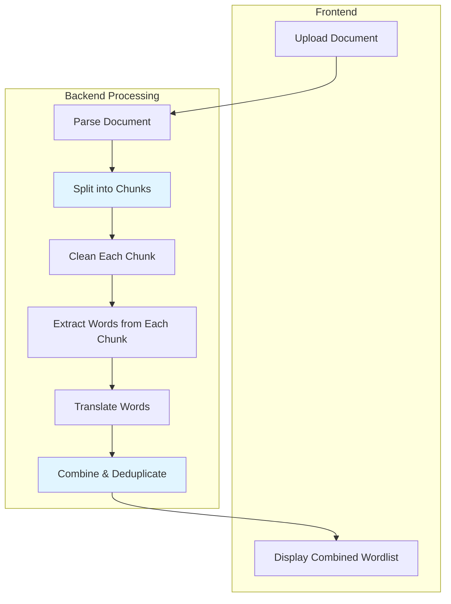
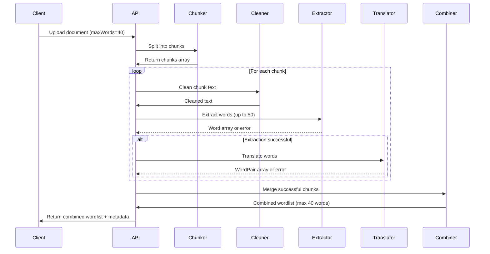

# Design Document: Chunk-Based Wordlist Generation

## Overview

This design implements a resilient chunk-based processing strategy for document wordlist extraction. Documents are split into manageable chunks (8,000 characters each), processed independently through the AI pipeline, and then combined into a single wordlist. This approach provides fault tolerance—if some chunks fail, users still receive results from successful chunks—while maintaining the simple UX of a single combined wordlist.

**Key Benefits:**
- **Resilience**: LLM failures on one chunk don't cause total failure
- **Scalability**: Large documents can be processed without overwhelming the LLM
- **Simplicity**: Users see one combined wordlist, not multiple separate lists
- **Backward Compatible**: Existing frontend code works without modifications

## Architecture

### High-Level Flow



### Processing Pipeline



## Components and Interfaces

### 1. Document Chunker

**Location**: `supabase/functions/_shared/chunking/documentChunker.ts`

```typescript
interface ChunkConfig {
  targetSize: number      // Target characters per chunk (8000)
  maxSize: number          // Maximum characters per chunk (10000)
  minSize: number          // Minimum chunk size (2000)
  overlapSize: number      // Overlap between chunks (200)
}

interface DocumentChunk {
  id: string               // Unique chunk identifier (e.g., "chunk-1")
  text: string             // Chunk text content
  startIndex: number       // Character position in original document
  endIndex: number         // Character position in original document
  position: number         // Chunk number (1-based)
  totalChunks: number      // Total number of chunks
}

interface ChunkingResult {
  chunks: DocumentChunk[]
  metadata: {
    originalLength: number
    totalChunks: number
    averageChunkSize: number
  }
}

function chunkDocument(text: string, config: ChunkConfig): ChunkingResult
```

**Chunking Strategy:**
1. If document ≤ 8,000 chars → single chunk (no splitting)
2. Split at paragraph boundaries (double newline)
3. If no paragraph boundary within 1,000 chars of target → split at sentence boundary
4. If no sentence boundary → split at word boundary
5. Add 200-char overlap between consecutive chunks for context continuity
6. Merge final chunk if < 2,000 chars

### 2. Chunk Processor

**Location**: `supabase/functions/_shared/processing/chunkProcessor.ts`

```typescript
interface ChunkProcessingResult {
  chunkId: string
  success: boolean
  words?: Array<{ en: string; zh: string }>
  error?: {
    code: string
    message: string
    stage: 'cleaning' | 'extraction' | 'translation'
  }
  metrics: {
    cleaningTimeMs: number
    extractionTimeMs: number
    translationTimeMs: number
    tokensUsed: number
  }
}

interface ProcessChunkOptions {
  chunk: DocumentChunk
  maxWordsPerChunk: number  // Up to 50 words per chunk
  documentType: string
}

async function processChunk(options: ProcessChunkOptions): Promise<ChunkProcessingResult>
```

**Processing Logic:**
1. Clean chunk text (remove noise)
2. Extract up to 50 words from chunk
3. Translate extracted words
4. Return result with success/error status
5. Log metrics for monitoring

**Error Handling:**
- Wrap each stage in try-catch
- If cleaning fails → return error, skip extraction/translation
- If extraction fails → return error, skip translation
- If translation fails → return error with extracted words
- Never throw exceptions (always return result object)

### 3. Wordlist Combiner

**Location**: `supabase/functions/_shared/combining/wordlistCombiner.ts`

```typescript
interface CombineOptions {
  chunkResults: ChunkProcessingResult[]
  maxWords: number          // Final word limit (10-50)
  priorityStrategy: 'first-chunk' | 'frequency' | 'random'
}

interface CombinedWordlist {
  words: Array<{ en: string; zh: string }>
  metadata: {
    totalChunksProcessed: number
    successfulChunks: number
    failedChunks: number
    duplicatesRemoved: number
    wordsBeforeLimit: number
    wordsAfterLimit: number
  }
}

function combineWordlists(options: CombineOptions): CombinedWordlist
```

**Combining Strategy:**
1. Collect all words from successful chunks
2. Remove exact duplicates (case-insensitive English word matching)
3. If duplicates exist, keep first occurrence (prioritize earlier chunks)
4. If total words > maxWords → truncate to maxWords
5. Return combined list with metadata

**Deduplication Logic:**
```typescript
// Example: If chunk 1 has "algorithm" and chunk 2 has "algorithm"
// Keep only the first occurrence from chunk 1
const seen = new Set<string>()
const combined: WordPair[] = []

for (const result of successfulChunks) {
  for (const wordPair of result.words) {
    const key = wordPair.en.toLowerCase()
    if (!seen.has(key)) {
      seen.add(key)
      combined.push(wordPair)
      if (combined.length >= maxWords) break
    }
  }
  if (combined.length >= maxWords) break
}
```

### 4. Updated Process Document Function

**Location**: `supabase/functions/process-document/index.ts`

```typescript
interface ProcessRequest {
  file?: {
    name: string
    type: string
    data: string  // base64
  }
  extractedText?: {
    text: string
    filename: string
    documentType: string
  }
  maxWords?: number  // 10-50, default 40
}

interface ProcessResponse {
  success: boolean
  wordlist?: {
    words: Array<{ en: string; zh: string }>
    filename: string
    documentType: string
    wordCount: number
  }
  metadata?: {
    processingTimeMs: number
    chunking: {
      totalChunks: number
      successfulChunks: number
      failedChunks: number
    }
    stages: {
      parsing: number
      chunking: number
      processing: number  // All chunks
      combining: number
    }
  }
  warnings?: string[]  // e.g., "3 of 5 chunks failed"
  error?: {
    code: string
    message: string
  }
}
```

**Updated Processing Flow:**
1. Parse/receive document text
2. Chunk document (if > 8,000 chars)
3. Process each chunk independently (parallel up to 3 concurrent)
4. Combine successful results
5. Return combined wordlist + metadata
6. Include warnings if any chunks failed

## Data Models

### Chunk Processing State

```typescript
interface ChunkState {
  chunkId: string
  status: 'pending' | 'processing' | 'completed' | 'failed'
  startTime?: number
  endTime?: number
  result?: ChunkProcessingResult
}

interface DocumentProcessingState {
  documentId: string
  chunks: ChunkState[]
  overallStatus: 'processing' | 'completed' | 'partial' | 'failed'
  startTime: number
  endTime?: number
}
```

### Response Metadata

```typescript
interface ChunkingMetadata {
  totalChunks: number
  successfulChunks: number
  failedChunks: number
  chunkSizes: number[]  // Array of chunk character counts
}

interface CombiningMetadata {
  duplicatesRemoved: number
  wordsBeforeLimit: number
  wordsAfterLimit: number
  priorityStrategy: string
}
```

## Error Handling

### Chunk-Level Errors

```typescript
enum ChunkErrorCode {
  CLEANING_FAILED = 'CHUNK_CLEANING_FAILED',
  EXTRACTION_FAILED = 'CHUNK_EXTRACTION_FAILED',
  TRANSLATION_FAILED = 'CHUNK_TRANSLATION_FAILED',
  TIMEOUT = 'CHUNK_TIMEOUT',
  LLM_ERROR = 'CHUNK_LLM_ERROR'
}

interface ChunkError {
  code: ChunkErrorCode
  message: string
  chunkId: string
  stage: 'cleaning' | 'extraction' | 'translation'
  retryable: boolean
}
```

### Document-Level Errors

```typescript
enum DocumentErrorCode {
  ALL_CHUNKS_FAILED = 'ALL_CHUNKS_FAILED',
  CHUNKING_FAILED = 'CHUNKING_FAILED',
  INVALID_WORD_COUNT = 'INVALID_WORD_COUNT',
  NO_WORDS_EXTRACTED = 'NO_WORDS_EXTRACTED'
}
```

### Error Recovery Strategy

1. **Single chunk fails**: Continue processing other chunks
2. **All chunks fail**: Return error response with details
3. **Partial success**: Return combined wordlist with warning
4. **Timeout**: Set 30-second timeout per chunk, fail gracefully
5. **LLM rate limit**: Retry with exponential backoff (max 3 retries)

## Performance Optimization

### Concurrent Processing

```typescript
// Process up to 3 chunks concurrently
const CONCURRENT_CHUNK_LIMIT = 3

async function processChunksConcurrently(
  chunks: DocumentChunk[],
  options: ProcessChunkOptions
): Promise<ChunkProcessingResult[]> {
  const results: ChunkProcessingResult[] = []
  
  for (let i = 0; i < chunks.length; i += CONCURRENT_CHUNK_LIMIT) {
    const batch = chunks.slice(i, i + CONCURRENT_CHUNK_LIMIT)
    const batchResults = await Promise.allSettled(
      batch.map(chunk => processChunk({ ...options, chunk }))
    )
    
    // Convert settled promises to results
    for (const result of batchResults) {
      if (result.status === 'fulfilled') {
        results.push(result.value)
      } else {
        // Create error result for rejected promise
        results.push({
          chunkId: batch[results.length].id,
          success: false,
          error: {
            code: 'CHUNK_PROCESSING_ERROR',
            message: result.reason?.message || 'Unknown error',
            stage: 'extraction'
          },
          metrics: { cleaningTimeMs: 0, extractionTimeMs: 0, translationTimeMs: 0, tokensUsed: 0 }
        })
      }
    }
  }
  
  return results
}
```

### Caching Strategy

- Cache cleaned text per chunk (in-memory, request-scoped)
- No persistent caching (documents are one-time processed)
- Reuse translator for all chunks (connection pooling)

### Token Optimization

- Limit each chunk to 50 words max (reduces token usage)
- Use concise prompts for extraction
- Calculate dynamic max_tokens: `min(wordCount * 2 + 50, 500)`

## Testing Strategy

### Unit Tests

**Chunker Tests** (`documentChunker.test.ts`):
- Small document (< 8,000 chars) → single chunk
- Large document → multiple chunks with correct boundaries
- Chunk overlap verification
- Edge cases: empty document, very long document

**Combiner Tests** (`wordlistCombiner.test.ts`):
- Deduplication across chunks
- Word limit enforcement
- Priority strategy (first-chunk)
- Metadata accuracy

**Chunk Processor Tests** (`chunkProcessor.test.ts`):
- Successful processing
- Cleaning failure handling
- Extraction failure handling
- Translation failure handling

### Integration Tests

**End-to-End Processing** (`chunk-processing.test.ts`):
- Single chunk document → combined wordlist
- Multi-chunk document → combined wordlist
- Partial failure (some chunks fail) → partial results
- Total failure (all chunks fail) → error response

### Performance Tests

- 30-page PDF → < 45 seconds total (allowing for chunking overhead)
- 5 chunks processed concurrently → verify parallelism
- Token usage per chunk → monitor costs
- Memory usage with large documents

## Monitoring and Observability

### Metrics to Track

```typescript
interface ChunkProcessingMetrics {
  documentId: string
  totalChunks: number
  successfulChunks: number
  failedChunks: number
  averageChunkProcessingTime: number
  totalProcessingTime: number
  tokensUsedPerChunk: number[]
  totalTokensUsed: number
  duplicatesRemoved: number
  finalWordCount: number
}
```

### Logging Strategy

```typescript
// Log at document level
console.log(`[Document ${docId}] Chunked into ${chunks.length} chunks`)

// Log at chunk level
console.log(`[Chunk ${chunkId}] Processing started`)
console.log(`[Chunk ${chunkId}] Extracted ${words.length} words in ${time}ms`)
console.log(`[Chunk ${chunkId}] Failed: ${error.message}`)

// Log at combining level
console.log(`[Combiner] Merged ${successfulChunks} chunks, removed ${duplicates} duplicates`)
console.log(`[Combiner] Final wordlist: ${finalCount} words`)
```

### Alerting

- Alert when > 50% of chunks fail for a document
- Alert when average chunk processing time > 15 seconds
- Alert when token usage per chunk > 5,000 tokens
- Alert when combining takes > 1 second

## Backward Compatibility

### API Response Format

The response format remains identical to the current single-wordlist format:

```typescript
// Current format (unchanged)
{
  success: true,
  wordlist: {
    words: [{ en: "algorithm", zh: "算法" }, ...],
    filename: "document.pdf",
    documentType: "pdf",
    wordCount: 40
  },
  metadata: {
    processingTimeMs: 12500,
    stages: { ... }
  }
}
```

**New optional fields** (backward compatible):
```typescript
{
  // ... existing fields ...
  metadata: {
    // ... existing fields ...
    chunking: {  // NEW: only present if chunking was used
      totalChunks: 3,
      successfulChunks: 3,
      failedChunks: 0
    }
  },
  warnings: [  // NEW: only present if issues occurred
    "1 of 3 chunks failed during processing"
  ]
}
```

### Frontend Changes

**No changes required** to existing frontend code. The ResultPage component will continue to work as-is.

**Optional enhancement** (future):
```vue
<!-- Display warning if chunks failed -->
<div v-if="warnings?.length" class="warning-banner">
  {{ warnings[0] }}
</div>
```

## Configuration

### Environment Variables

```bash
# Chunking configuration
CHUNK_TARGET_SIZE=8000
CHUNK_MAX_SIZE=10000
CHUNK_MIN_SIZE=2000
CHUNK_OVERLAP_SIZE=200

# Processing configuration
MAX_CONCURRENT_CHUNKS=3
CHUNK_TIMEOUT_MS=30000

# Word limits
MIN_WORDS_PER_DOCUMENT=10
MAX_WORDS_PER_DOCUMENT=50
DEFAULT_WORDS_PER_DOCUMENT=40
MAX_WORDS_PER_CHUNK=50
```

### Feature Flags

```typescript
const FEATURE_FLAGS = {
  enableChunking: true,           // Master switch for chunking
  enableConcurrentProcessing: true,
  enableChunkCaching: false,      // Future: cache cleaned chunks
  chunkPriorityStrategy: 'first-chunk' as const
}
```

## Migration Strategy

### Phase 1: Implementation (Week 1)
1. Implement document chunker
2. Implement chunk processor with error handling
3. Implement wordlist combiner
4. Update process-document function

### Phase 2: Testing (Week 1)
1. Unit tests for all new components
2. Integration tests for chunk processing
3. Performance tests with large documents
4. Backward compatibility verification

### Phase 3: Deployment (Week 2)
1. Deploy to staging environment
2. Test with real documents
3. Monitor metrics and logs
4. Deploy to production with feature flag
5. Gradual rollout (10% → 50% → 100%)

### Rollback Plan

If issues arise:
1. Disable chunking via feature flag
2. System falls back to current single-pass processing
3. No data loss or corruption (stateless processing)
4. Investigate and fix issues
5. Re-enable chunking

## Future Enhancements

### Phase 2 Features
- **Smart chunk sizing**: Adjust chunk size based on document type
- **Chunk-level caching**: Cache cleaned chunks for retry scenarios
- **Parallel translation**: Translate all chunks' words in parallel
- **Word frequency ranking**: Prioritize more frequent words across chunks

### Phase 3 Features
- **Streaming results**: Return words as chunks complete (WebSocket)
- **User-visible chunks**: Option to show chunk boundaries in UI
- **Chunk-level retry**: Allow users to retry failed chunks
- **Advanced deduplication**: Keep best translation when duplicates exist
