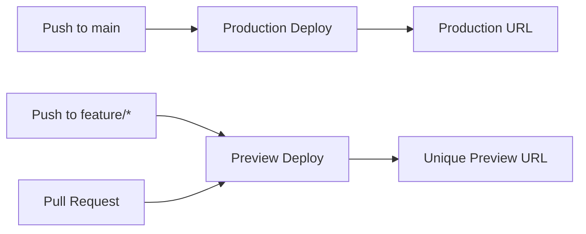

# Vercel Deployment Design

## Overview

This document outlines the comprehensive design for deploying VocabGo (a Vue 3 + TypeScript + Supabase application) to Vercel's hosting platform. The deployment strategy focuses on seamless integration with the existing Supabase backend, optimized build processes, automated CI/CD pipelines, and production-ready configuration.

## Architecture

### High-Level Deployment Flow

```
┌─────────────────┐
│  GitHub Repo    │
│  (Source Code)  │
└────────┬────────┘
         │
         │ Git Push
         ▼
┌─────────────────┐
│  Vercel         │
│  Platform       │
├─────────────────┤
│ 1. Detect Push  │
│ 2. Clone Repo   │
│ 3. Install Deps │
│ 4. Type Check   │
│ 5. Build (Vite) │
│ 6. Deploy CDN   │
└────────┬────────┘
         │
         │ Serves
         ▼
┌─────────────────┐      ┌──────────────────┐
│   End Users     │◄────►│  Supabase        │
│   (Browser)     │      │  Backend         │
│                 │      │  - Database      │
│                 │      │  - Storage       │
│                 │      │  - Edge Funcs    │
└─────────────────┘      └──────────────────┘
```

### Technology Stack Integration

- **Frontend**: Vue 3 + TypeScript + Vite
- **Hosting**: Vercel (Static Site + Serverless Functions)
- **Backend**: Supabase (Database, Storage, Edge Functions)
- **Build Tool**: Vite 5.x
- **Package Manager**: pnpm 9.x
- **CI/CD**: Vercel Git Integration

## Components and Interfaces

### 1. Vercel Project Configuration

#### Project Settings
```typescript
interface VercelProjectConfig {
  framework: 'vite'
  buildCommand: 'pnpm build'
  outputDirectory: 'dist'
  installCommand: 'pnpm install'
  devCommand: 'pnpm dev'
  nodeVersion: '20.x'
}
```

#### Build Configuration (vercel.json)
```json
{
  "buildCommand": "pnpm build",
  "outputDirectory": "dist",
  "framework": "vite",
  "installCommand": "pnpm install",
  "devCommand": "pnpm dev"
}
```

### 2. Environment Variable Management

#### Required Environment Variables

**Build-Time Variables** (injected during build):
```typescript
interface BuildTimeEnvVars {
  VITE_SUPABASE_URL: string        // Supabase project URL
  VITE_SUPABASE_ANON_KEY: string   // Supabase anonymous key
}
```

**Configuration in Vercel Dashboard**:
- Navigate to: Project Settings → Environment Variables
- Add variables for: Production, Preview, Development
- Variables are encrypted at rest
- Accessible during build process via `import.meta.env`

#### Environment Variable Validation

```typescript
// src/lib/env.ts
export function validateEnv() {
  const required = [
    'VITE_SUPABASE_URL',
    'VITE_SUPABASE_ANON_KEY'
  ]
  
  const missing = required.filter(
    key => !import.meta.env[key]
  )
  
  if (missing.length > 0) {
    throw new Error(
      `Missing required environment variables: ${missing.join(', ')}`
    )
  }
}
```

### 3. Build Process Optimization

#### Vite Build Configuration

```typescript
// vite.config.ts enhancements for production
export default defineConfig({
  build: {
    target: 'es2020',
    minify: 'terser',
    terserOptions: {
      compress: {
        drop_console: true,
        drop_debugger: true
      }
    },
    rollupOptions: {
      output: {
        manualChunks: {
          'vue-vendor': ['vue', 'vue-router'],
          'supabase-vendor': ['@supabase/supabase-js'],
          'ui-vendor': ['gsap']
        }
      }
    },
    chunkSizeWarningLimit: 1000,
    sourcemap: false // Disable in production for security
  },
  optimizeDeps: {
    include: ['vue', 'vue-router', '@supabase/supabase-js']
  }
})
```

#### Build Steps Sequence

1. **Install Dependencies**: `pnpm install --frozen-lockfile`
2. **Type Checking**: `vue-tsc -b`
3. **Build Assets**: `vite build`
4. **Output**: Static files in `dist/` directory

### 4. Deployment Pipeline

#### Git Integration Workflow



#### Deployment Stages

**Stage 1: Build**
- Clone repository
- Install dependencies with pnpm
- Run type checking
- Execute build command
- Generate static assets

**Stage 2: Deploy**
- Upload assets to Vercel CDN
- Configure routing rules
- Enable HTTPS
- Update DNS (if custom domain)

**Stage 3: Verification**
- Run Lighthouse audit
- Check deployment status
- Verify environment variables
- Test application endpoints

### 5. Routing Configuration

#### SPA Routing Setup

```json
// vercel.json
{
  "routes": [
    {
      "src": "/assets/(.*)",
      "headers": {
        "cache-control": "public, max-age=31536000, immutable"
      }
    },
    {
      "handle": "filesystem"
    },
    {
      "src": "/(.*)",
      "dest": "/index.html"
    }
  ],
  "headers": [
    {
      "source": "/(.*)",
      "headers": [
        {
          "key": "X-Content-Type-Options",
          "value": "nosniff"
        },
        {
          "key": "X-Frame-Options",
          "value": "DENY"
        },
        {
          "key": "X-XSS-Protection",
          "value": "1; mode=block"
        }
      ]
    }
  ]
}
```

### 6. Custom Domain Configuration

#### DNS Configuration

**Option A: Vercel Nameservers**
```
Type: NS
Name: @
Value: ns1.vercel-dns.com
Value: ns2.vercel-dns.com
```

**Option B: CNAME Record**
```
Type: CNAME
Name: www (or subdomain)
Value: cname.vercel-dns.com
```

**Option C: A Record**
```
Type: A
Name: @
Value: 76.76.21.21
```

#### SSL Certificate Provisioning

- Automatic SSL via Let's Encrypt
- Certificate auto-renewal
- HTTPS redirect enabled by default
- HTTP/2 and HTTP/3 support

### 7. Performance Monitoring

#### Web Vitals Tracking

```typescript
// src/lib/analytics.ts
import { onCLS, onFID, onLCP, onFCP, onTTFB } from 'web-vitals'

export function initWebVitals() {
  onCLS(metric => sendToAnalytics(metric))
  onFID(metric => sendToAnalytics(metric))
  onLCP(metric => sendToAnalytics(metric))
  onFCP(metric => sendToAnalytics(metric))
  onTTFB(metric => sendToAnalytics(metric))
}

function sendToAnalytics(metric: Metric) {
  // Send to Vercel Analytics or custom endpoint
  if (window.va) {
    window.va('track', metric.name, metric.value)
  }
}
```

#### Lighthouse CI Integration

```json
// lighthouserc.json
{
  "ci": {
    "collect": {
      "url": ["http://localhost:4173"],
      "numberOfRuns": 3
    },
    "assert": {
      "assertions": {
        "categories:performance": ["error", {"minScore": 0.9}],
        "categories:accessibility": ["error", {"minScore": 0.9}],
        "categories:best-practices": ["error", {"minScore": 0.9}],
        "categories:seo": ["error", {"minScore": 0.9}]
      }
    }
  }
}
```

### 8. Preview Deployments

#### Preview URL Structure

```
https://<project>-<hash>-<team>.vercel.app
```

#### Preview Environment Configuration

- Unique URL per branch/PR
- Isolated environment variables
- Automatic cleanup after PR merge
- Comment integration in GitHub PRs

### 9. Rollback Strategy

#### Deployment History

- Vercel maintains complete deployment history
- Each deployment is immutable
- Instant rollback to any previous deployment
- Zero-downtime rollback process

#### Rollback Process

```bash
# Via Vercel CLI
vercel rollback <deployment-url>

# Via Dashboard
# 1. Navigate to Deployments
# 2. Select previous deployment
# 3. Click "Promote to Production"
```

### 10. Build Cache Optimization

#### Cache Strategy

```typescript
interface CacheConfig {
  dependencies: {
    key: 'pnpm-lock.yaml'
    paths: ['node_modules', '.pnpm-store']
  }
  buildOutput: {
    key: 'vite-build-cache'
    paths: ['node_modules/.vite']
  }
}
```

#### Cache Invalidation

- Automatic invalidation on `pnpm-lock.yaml` changes
- Manual cache clear via Vercel Dashboard
- Cache hit rate monitoring

## Data Models

### Deployment Metadata

```typescript
interface DeploymentMetadata {
  id: string
  url: string
  state: 'BUILDING' | 'READY' | 'ERROR' | 'CANCELED'
  createdAt: Date
  buildTime: number // milliseconds
  source: {
    type: 'github'
    repo: string
    branch: string
    commit: string
  }
  environment: 'production' | 'preview' | 'development'
}
```

### Build Logs

```typescript
interface BuildLog {
  deploymentId: string
  timestamp: Date
  level: 'info' | 'warn' | 'error'
  message: string
  phase: 'install' | 'build' | 'deploy'
}
```

## Error Handling

### Build Failure Scenarios

1. **Type Check Failures**
   - Error: TypeScript compilation errors
   - Solution: Fix type errors before deployment
   - Prevention: Run `pnpm type-check` locally

2. **Missing Environment Variables**
   - Error: Build fails due to undefined env vars
   - Solution: Add variables in Vercel Dashboard
   - Prevention: Validate env vars in build script

3. **Dependency Installation Failures**
   - Error: pnpm install fails
   - Solution: Check pnpm-lock.yaml integrity
   - Prevention: Commit lock file changes

4. **Build Timeout**
   - Error: Build exceeds time limit (45 minutes)
   - Solution: Optimize build process
   - Prevention: Monitor build times

### Runtime Error Monitoring

```typescript
// src/lib/errorTracking.ts
export function initErrorTracking() {
  window.addEventListener('error', (event) => {
    logError({
      message: event.message,
      stack: event.error?.stack,
      url: window.location.href,
      timestamp: new Date()
    })
  })
  
  window.addEventListener('unhandledrejection', (event) => {
    logError({
      message: event.reason?.message || 'Unhandled Promise Rejection',
      stack: event.reason?.stack,
      url: window.location.href,
      timestamp: new Date()
    })
  })
}
```

## Testing Strategy

### Pre-Deployment Testing

1. **Local Build Verification**
   ```bash
   pnpm build
   pnpm preview
   ```

2. **Type Checking**
   ```bash
   pnpm type-check
   ```

3. **Environment Variable Validation**
   ```bash
   # Test with production-like env vars
   cp .env.example .env.local
   # Fill in values
   pnpm dev
   ```

### Post-Deployment Testing

1. **Smoke Tests**
   - Homepage loads
   - Navigation works
   - Supabase connection successful
   - File upload functional

2. **Performance Tests**
   - Lighthouse audit scores
   - Core Web Vitals metrics
   - Bundle size analysis

3. **Integration Tests**
   - Supabase Edge Functions connectivity
   - Database queries
   - Storage operations

## Security Considerations

### Environment Variable Security

- Never commit `.env.local` to git
- Use Vercel's encrypted environment variables
- Rotate keys regularly
- Use different keys for preview/production

### Content Security Policy

```typescript
// Add to vercel.json headers
{
  "key": "Content-Security-Policy",
  "value": "default-src 'self'; script-src 'self' 'unsafe-inline' 'unsafe-eval'; style-src 'self' 'unsafe-inline'; img-src 'self' data: https:; font-src 'self' data:; connect-src 'self' https://*.supabase.co"
}
```

### CORS Configuration

- Configured in Supabase Dashboard
- Allow Vercel production and preview domains
- Restrict to specific origins in production

## Monitoring and Observability

### Key Metrics to Track

1. **Build Metrics**
   - Build duration
   - Build success rate
   - Cache hit rate

2. **Performance Metrics**
   - Time to First Byte (TTFB)
   - First Contentful Paint (FCP)
   - Largest Contentful Paint (LCP)
   - Cumulative Layout Shift (CLS)
   - First Input Delay (FID)

3. **Error Metrics**
   - Error rate
   - Error types
   - Affected users

### Alerting Strategy

- Build failure notifications via email/Slack
- Performance degradation alerts
- Error rate threshold alerts
- Uptime monitoring

## Cost Optimization

### Vercel Pricing Considerations

- **Hobby Plan**: Free for personal projects
- **Pro Plan**: $20/month per user
- **Enterprise**: Custom pricing

### Optimization Strategies

1. **Reduce Build Time**
   - Enable build caching
   - Optimize dependencies
   - Parallelize build steps

2. **Reduce Bandwidth**
   - Optimize images
   - Enable compression
   - Use efficient code splitting

3. **Reduce Function Invocations**
   - Cache API responses
   - Batch requests
   - Use static generation where possible

## Integration with Existing Infrastructure

### Supabase Integration

```typescript
// src/lib/supabase.ts
import { createClient } from '@supabase/supabase-js'

const supabaseUrl = import.meta.env.VITE_SUPABASE_URL
const supabaseAnonKey = import.meta.env.VITE_SUPABASE_ANON_KEY

if (!supabaseUrl || !supabaseAnonKey) {
  throw new Error('Missing Supabase environment variables')
}

export const supabase = createClient(supabaseUrl, supabaseAnonKey)
```

### Edge Functions Connectivity

- Edge Functions remain on Supabase
- Frontend calls Edge Functions via HTTPS
- CORS configured to allow Vercel domains
- Authentication handled via Supabase Auth

## Deployment Checklist

### Pre-Deployment

- [ ] Code reviewed and merged to main
- [ ] All tests passing locally
- [ ] Environment variables documented
- [ ] Build succeeds locally
- [ ] Type checking passes
- [ ] No console errors in preview

### Deployment

- [ ] Vercel project created
- [ ] GitHub repository connected
- [ ] Environment variables configured
- [ ] Build settings verified
- [ ] Custom domain configured (if applicable)
- [ ] SSL certificate provisioned

### Post-Deployment

- [ ] Application loads successfully
- [ ] All routes accessible
- [ ] Supabase connection working
- [ ] File uploads functional
- [ ] Performance metrics acceptable
- [ ] Error tracking configured
- [ ] Monitoring alerts set up

## Design Decisions and Rationale

### Why Vercel?

1. **Optimized for Frontend Frameworks**: Native Vite support
2. **Global CDN**: Fast content delivery worldwide
3. **Zero Configuration**: Automatic framework detection
4. **Preview Deployments**: Easy PR review process
5. **Excellent DX**: Simple CLI and dashboard
6. **Scalability**: Automatic scaling based on traffic

### Why Not Serverless Functions on Vercel?

- Backend logic already on Supabase Edge Functions
- Avoid vendor lock-in
- Maintain single source of truth for backend
- Supabase provides better database integration

### Build Tool Choice

- Vite already configured in project
- Fast build times
- Excellent HMR for development
- Modern ES modules support
- Tree-shaking and code splitting

## Future Enhancements

1. **Edge Middleware**: Add authentication checks at edge
2. **ISR (Incremental Static Regeneration)**: For semi-static content
3. **A/B Testing**: Using Vercel Edge Config
4. **Advanced Analytics**: Custom event tracking
5. **Multi-Region Deployment**: Optimize for specific regions
